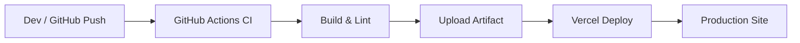

# TalentFlow — Technical Guide

This guide documents the full technology stack, installation and setup steps, runtime behavior, architecture, and CI/CD flow for the TalentFlow job board.

**Contents**
- Tech stack
- Prerequisites
- Installation & local development (step-by-step)
- Project structure and component mapping
- Runtime behavior & feature flows (search, filters, post)
- CI/CD and deployment to Vercel
- Architecture diagrams (Mermaid)

---

## Tech stack
- Framework: Next.js 16 (app router)
- UI: React 19
- Styling: Tailwind-style utility classes + custom CSS in `app/globals.css`
- Languages: TypeScript
- Linter: ESLint
- Build/runtime: Node.js 20+ and `npm`
- CI: GitHub Actions (`.github/workflows/ci.yml`)
- Deployment: Vercel (recommended) via `vercel/action@v3`

## Prerequisites
- Node.js 20.x installed
- npm (bundled with Node) or an alternative package manager
- Git installed and configured
- A GitHub repository for the project
- A Vercel account and a Project created (optional: Vercel CLI for local deploys)

## Installation & local development (step-by-step)
1. Clone the repository

```bash
git clone <repo-url>
cd ai-job-board
```

2. Install dependencies

```bash
npm install
```

3. Development server

```bash
npm run dev
# Open http://localhost:3000
```

4. Linting and formatting

```bash
npm run lint
```

5. Build for production locally

```bash
npm run build
```

6. Local production preview (Next.js)

```bash
npm run start
# Runs .next production build
```

7. Optional: Deploy locally using Vercel CLI

```bash
npm i -g vercel
vercel login
vercel link
npm run build
vercel --prod
```

## Environment and Secrets (for CI/CD)
The GitHub Actions deploy uses Vercel. Set the following repository secrets (GitHub → Settings → Secrets and variables → Actions):
- `VERCEL_TOKEN` — Personal token from Vercel (Account → Tokens)
- `VERCEL_ORG_ID` — Organization/Team ID for the Vercel project
- `VERCEL_PROJECT_ID` — Project ID for the Vercel project

Add secrets as GitHub repository secrets; the workflow reads them in the `deploy` job.

## Project structure (high-level)
- `app/` — Next.js app routes and global CSS (`app/globals.css`)
- `components/` — UI components (layout, jobs, landing, ui primitives)
- `lib/` — helper functions, data loading (e.g. `lib/jobs.ts`)
- `data/` — seed data (`jobs.json`)
- `public/` — static assets
- `docs/` — documentation (this file + FEATURES)
- `.github/workflows/ci.yml` — CI/CD pipeline

Important components and mapping:
- `components/layout/SiteHeader` — global navigation
- `components/landing/HeroSection` & `HeroSearch` — landing search and tags
- `components/jobs/JobList` + `JobCard` — main listing UI
- `components/jobs/JobFilters` — search + filters form
- `components/jobs/JobDetail` — full job page

## Data flow & runtime behavior
- Data: `lib/jobs.ts` loads and filters `data/jobs.json` (synchronously for demo). Replace with a DB/API when needed.
- Searching:
  - `JobFilters` submits a GET form to `/jobs?q=...&location=...`
  - Next.js route `app/jobs/page.tsx` reads `searchParams` and calls `filterJobs(...)`
  - Filtered jobs are passed to `JobList` which renders `JobCard` components
- Job detail:
  - Clicking a `JobCard` navigates to `/jobs/[id]` to show full details
- Posting a job (simple form): sends form data to a Next.js route (placeholder flow — add persistence to save)

## Feature walkthrough (step-by-step)
1. User lands on `/` (Home)
  - Searches from hero or clicks a category pill
2. Browser navigates to `/jobs?q=...`
  - Jobs page runs `filterJobs` using `q` and `location`
  - Results displayed in a responsive grid, cards use `line-clamp-3` for descriptions
3. User clicks a job card
  - Navigates to `/jobs/[id]` showing details and badges
4. User can post a job via `/jobs/new`
  - Submits form; currently persistence is not wired to a DB in this demo

## CI / CD (GitHub Actions → Vercel)
- Workflow path: `.github/workflows/ci.yml`
- Jobs:
  - `ci`: checkout, setup Node, install, lint, build
  - `artifact`: build and upload `.next` on `main`
  - `deploy`: runs on `main`, builds and calls `vercel/action@v3` with secrets

Important: `VERCEL_TOKEN`, `VERCEL_ORG_ID`, and `VERCEL_PROJECT_ID` must be set in repo secrets.

### How the `deploy` job authenticates
The `vercel/action@v3` action uses `vercel-token` and project/org ids to create/update a deployment. The action will upload project files and trigger a Vercel deploy.

## Architecture diagrams

**Application flow (user interactions)**

```mermaid
flowchart TD
  User[User]
  Site[Next.js App]
  JobsList[Jobs Listing]
  JobDetail[Job Detail]
  PostJob[Post Job Form]
  Data[Data Source (data/jobs.json or API)]

  User --> Site
  Site --> JobsList
  JobsList --> JobDetail
  Site --> PostJob
  JobsList --> Data
  JobDetail --> Data
  PostJob --> Data
```

**CI/CD flow**



## Architecture notes and extension points
- Replace `data/jobs.json` with a database (Postgres, MongoDB) or external API; implement server-side API routes to read/write jobs.
- Add preview deploys: Vercel automatically creates preview deploys per PR if connected to the GitHub repo — no extra config needed beyond linking project.
- Persist `POST /jobs` form submissions to a database or a serverless function that saves to a storage backend.
- Add authentication (e.g., GitHub OAuth) to allow companies to manage job listings.

## Troubleshooting & common tasks
- Node not found / Git not found: install them and ensure they are on `PATH`.
- CI failure: view logs in Actions UI, check `npm run lint` output and `npm run build` errors.
- Vercel deploy failure: ensure `VERCEL_TOKEN`, `VERCEL_ORG_ID`, and `VERCEL_PROJECT_ID` are correct and have access to the project.

## Quick commands

```bash
# Dev
npm run dev

# Lint
npm run lint

# Build
npm run build

# Start production preview
npm run start
```

---

If you want, I can:
- Add a `docs/CONTRIBUTING.md` with PR and release guidelines
- Add a `docs/DEPLOYMENT.md` with step-by-step screenshots for Vercel setup and GitHub secrets
- Generate a PNG/SVG of the mermaid diagrams and add them to `docs/` for easier viewing in external tools

Tell me which of the above you'd like next and I'll add it to the docs and TODOs.